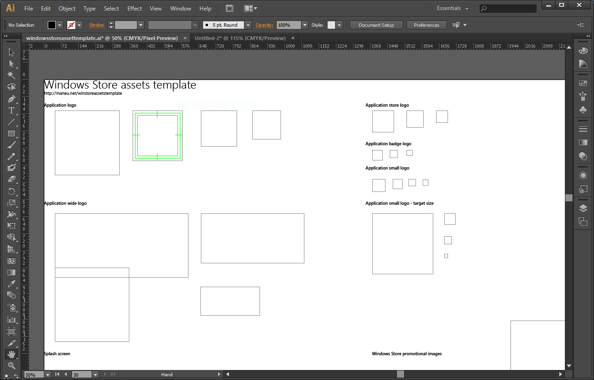

# Windows Store Apps design assets template

by Christopher Maneu - [@cmaneu](http://twitter.com/cmaneu)

## Introduction

This Adobe Illustrator file helps you to create all the necessary assets for Windows Store apps.

 

## How to use it

1. Use the illustrator file to create your assets,
2. Use the Export option, 
3. Choose PNG file type, and **check "Use Artboard"**
4. Use it in Visual Studio / Store Dashboard

## Assets for the Windows App
- Logo
- Wide logo
- Small logo
- Store logo
- Badge logo
- Splash screen 
- Windows Store promotional images

# Next steps

**You can use the issues tab to suggest ideas**

- Adding help on a specific layer, 
- Create Windows Phone version